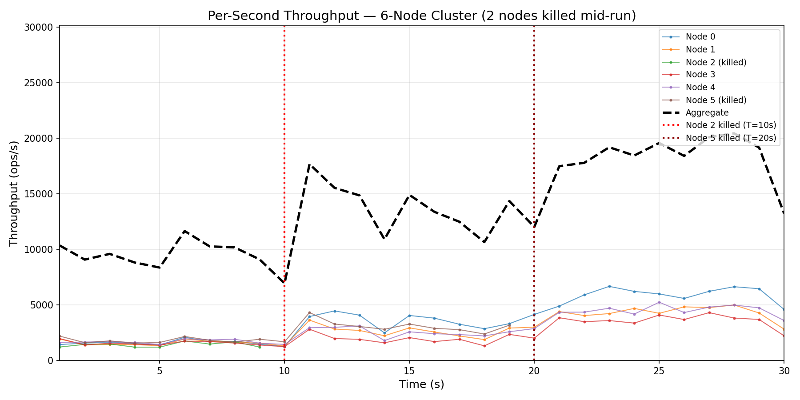
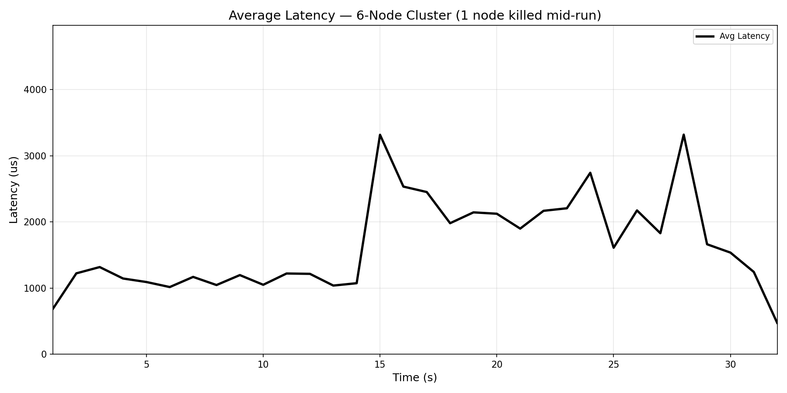

# Replicated Hash Table

An in-memory, Multi-Raft replicated key-value store with cross-shard two-phase commit. Written in C++20 using raw TCP sockets (standalone Asio, no Boost).

## Architecture

**N** processes form a fully connected TCP mesh. The key space is partitioned into **N shards** (`key % N`), each replicated by a 3-member Raft group:

```
shard(s) members = { s, (s+1) % N, (s+2) % N }
```

Each node hosts up to 3 Raft instances (one per shard it belongs to). Only the shard leader accepts writes; followers serve stale reads.

### Operations

| Operation | Path |
|-----------|------|
| `get(key)` | Read from any local replica (leader or follower). Forward if node is not a member of the shard. |
| `put(key, val)` | Single Raft proposal on the shard leader. Redirects follow leader hints. |
| `put3(k1,k2,k3)` | If all keys map to one shard: single proposal. Otherwise: **2PC** across shard leaders -- prepare and commit are each replicated through Raft. |

### Consensus

Standard Raft with leader election, log replication, and commit index advancement. Per-peer persistent replication threads wake on condition variables (no thread-per-RPC overhead). Separate TCP connection pools for application traffic and Raft RPCs to avoid head-of-line blocking.

## Build

```bash
mkdir -p build && cd build
cmake .. -DCMAKE_BUILD_TYPE=Release
make -j$(nproc)
```

Produces a statically linked binary -- build once, `scp` to other machines.

## Run

Each process takes: `<index> <port> <ip:port list of all nodes>`

### Local (single machine)

```bash
python3 startup_local.py --nodes 6 --duration 30
python3 startup_local.py --nodes 6 --duration 30 --kill-node 2 --kill-at 15
```

### Remote (SSH cluster)

Configure `SSH_USER`, `DOMAIN`, and `MACHINES` in `startup.py`, then:

```bash
python3 startup.py --nodes 6 --duration 60
python3 startup.py --nodes 6 --duration 30 --kill-node 2 --kill-at 15
python3 startup.py --sweep 4,6,8,10 --duration 60
```

Logs are downloaded to `local_run_logs/` automatically.

### Generate plots

```bash
python3 plot_throughput.py
```

Produces `throughput_plot.png` and `latency_plot.png` from the logs in `local_run_logs/`.

## Results

6-node cluster, node killed at T=15s:

### Throughput



Aggregate throughput drops briefly at the kill event as affected Raft groups run elections (~150-350ms timeout), then recovers as new leaders are elected. No shard loses quorum since each has 3 members and only 1 is killed.

### Latency



Average latency spikes during the election window due to socket timeouts on dead connections, then stabilizes at a higher baseline (fewer nodes serving the same workload).

